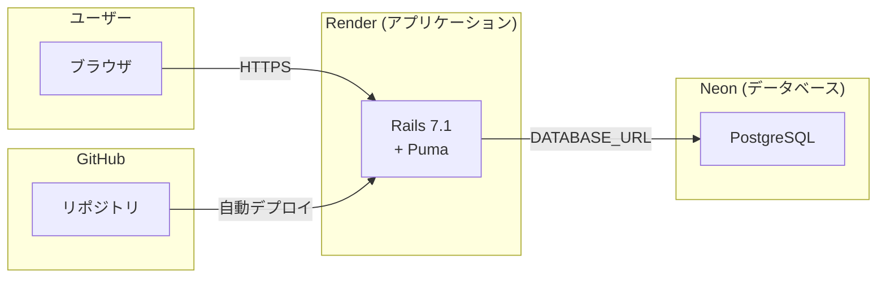

# らんてくんのブログ

Rails 7.1 + PostgreSQL + Tailwind CSSで構築した個人ブログサービス

## 機能

- 記事一覧・詳細表示（公開）
- 記事の投稿・編集・削除（管理画面 / Basic認証）
- Markdownレンダリング対応
- プロフィールページ

## ローカル開発

### 必要なもの

- Docker
- Docker Compose

### セットアップファイル（コピペOK）

#### Dockerfile.dev

```dockerfile
FROM ruby:3.2-slim

RUN apt-get update -qq && \
    apt-get install -y --no-install-recommends \
    build-essential \
    libpq-dev \
    libyaml-dev \
    nodejs \
    npm \
    git \
    curl && \
    npm install -g yarn && \
    apt-get clean && \
    rm -rf /var/lib/apt/lists/*

WORKDIR /app

COPY Gemfile Gemfile.lock ./
RUN bundle install

COPY . .

EXPOSE 3000
CMD ["bin/rails", "server", "-b", "0.0.0.0"]
```

#### docker-compose.yml

```yaml
services:
  db:
    image: postgres:15
    environment:
      POSTGRES_USER: postgres
      POSTGRES_PASSWORD: password
    volumes:
      - postgres_data:/var/lib/postgresql/data
    ports:
      - "5432:5432"

  web:
    build:
      context: .
      dockerfile: Dockerfile.dev
    command: bash -c "rm -f tmp/pids/server.pid && bin/dev"
    volumes:
      - .:/app
      - bundle_data:/usr/local/bundle
    ports:
      - "3000:3000"
    depends_on:
      - db
    environment:
      DATABASE_URL: postgres://postgres:password@db:5432/blog_development
      BLOG_USER: admin
      BLOG_PASSWORD: password
    tty: true
    stdin_open: true

volumes:
  postgres_data:
  bundle_data:
```

#### Gemfile（初期）

```ruby
source "https://rubygems.org"

gem "rails", "~> 7.1.0"
```

#### Gemfile.lock（空ファイル）

```
# 空のファイルを作成
touch Gemfile.lock
```

### 起動コマンド

```bash
# 1. Railsプロジェクト生成（初回のみ）
docker compose build
docker compose run --rm web rails new . --force --database=postgresql --css=tailwind --skip-git

# 2. Procfile.devを編集（0.0.0.0でバインド）
# web: bin/rails server -b 0.0.0.0
# css: bin/rails tailwindcss:watch

# 3. データベース作成
docker compose run --rm web rails db:create db:migrate

# 4. 起動
docker compose up
```

http://localhost:3000 でアクセス

### 管理画面

- URL: http://localhost:3000/admin/posts
- ユーザー名: `admin`
- パスワード: `password`

## デプロイ（Render + Neon）

### アーキテクチャ



| サービス | 役割 | 料金 |
|---------|------|------|
| **Render** | Railsアプリのホスティング | Free（750時間/月） |
| **Neon** | PostgreSQLデータベース | Free（0.5GB） |
| **GitHub** | ソースコード管理・自動デプロイ連携 | Free |

### デプロイ用ファイル（コピペOK）

#### bin/render-build.sh

```bash
#!/usr/bin/env bash
# exit on error
set -o errexit

bundle install
bundle exec rails assets:precompile
bundle exec rails assets:clean
bundle exec rails db:migrate
```

作成後、実行権限を付与：
```bash
chmod +x bin/render-build.sh
```

#### render.yaml

```yaml
services:
  - type: web
    name: runtekun-blog
    runtime: ruby
    buildCommand: "./bin/render-build.sh"
    startCommand: "bundle exec puma -C config/puma.rb"
    envVars:
      - key: DATABASE_URL
        sync: false
      - key: RAILS_MASTER_KEY
        sync: false
      - key: BLOG_USER
        sync: false
      - key: BLOG_PASSWORD
        sync: false
      - key: RAILS_ENV
        value: production
      - key: RAILS_LOG_TO_STDOUT
        value: "true"
```

#### config/database.yml（production部分）

```yaml
production:
  <<: *default
  url: <%= ENV["DATABASE_URL"] %>
```

#### config/environments/production.rb（変更箇所）

```ruby
# 23行目あたりを以下に変更
config.public_file_server.enabled = ENV["RAILS_SERVE_STATIC_FILES"].present? || true
```

### 1. Neonでデータベース作成

1. [Neon](https://neon.tech) でアカウント作成
2. 新しいプロジェクトを作成
3. Connection string（`postgres://...`）をコピー

### 2. Renderでデプロイ

1. [Render](https://render.com) でアカウント作成
2. 「New +」→「Web Service」を選択
3. 「Build and deploy from a Git repository」→「Next」
4. GitHubリポジトリを接続（Connect GitHub）
5. 対象リポジトリの「Connect」をクリック

6. 以下を設定：

| 項目 | 値 |
|------|-----|
| **Name** | runtekun-blog（任意） |
| **Region** | Singapore (Southeast Asia) など |
| **Branch** | main |
| **Language** | Ruby |
| **Build Command** | `./bin/render-build.sh` |
| **Start Command** | `bundle exec puma -C config/puma.rb` |
| **Instance Type** | Free |

7. 「Environment Variables」セクションで「Add Environment Variable」をクリックし、以下を追加：

| Key | Value |
|-----|-------|
| `DATABASE_URL` | Neonの接続文字列（`postgres://...`） |
| `RAILS_MASTER_KEY` | `config/master.key`の内容 |
| `BLOG_USER` | 管理画面のユーザー名（任意） |
| `BLOG_PASSWORD` | 管理画面のパスワード（任意） |

8. 「Create Web Service」をクリック

### Blueprint（自動デプロイ）

`render.yaml`を使用して自動デプロイも可能：

1. Renderダッシュボードで「New +」→「Blueprint」
2. リポジトリを選択
3. 環境変数を設定

## 技術スタック

- Ruby 3.2
- Rails 7.1
- PostgreSQL
- Tailwind CSS
- Redcarpet（Markdown）
